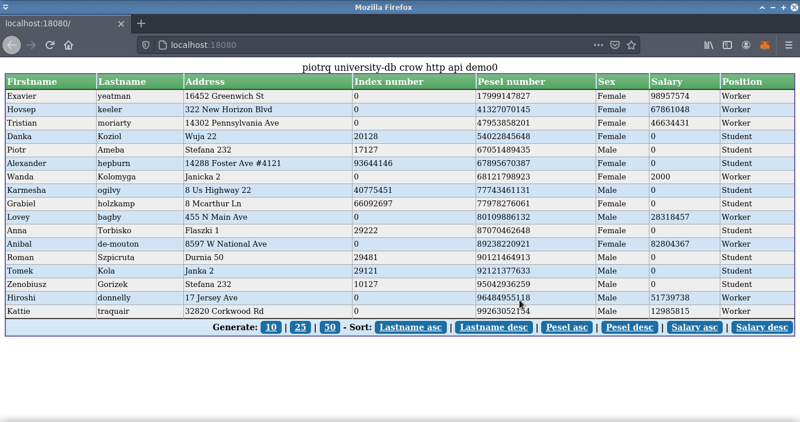

# piotrq - university-db
Homework project for Coders School. Training.

Authors:
Main Code: Piotr K (https://github.com/piotrku91, piotrq.eu)
Function tokenize() from our another project: Piotr R (https://github.com/Rogal255)

## Test viedo:
https://www.youtube.com/watch?v=JFIHc3mh8-E

## Test screenshots:

## How to compile and run

>   Type:

    cd build
    cmake ..
    make
    ./university-db (for app)
    ctest -V (for tests)

